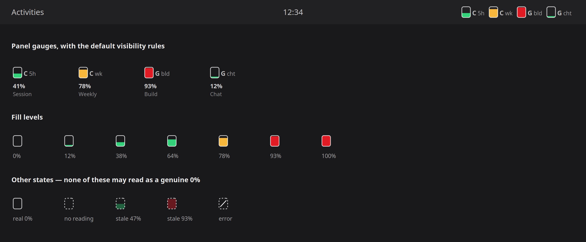

# AI Quota

A GNOME Shell panel indicator that shows how much of each AI coding quota you
have consumed. One gauge per quota, filling from empty to full as you spend it.

Hover for the percentage, the time until reset, and the exact reset time. Click
for every quota including the hidden ones, each provider's plan, and how fresh
the reading is.

Supports **Claude Code**, **Grok Build**, and **Codex**.



---

## Why this exists

There are around ten GNOME extensions that monitor Claude usage. When this was
written there were **none for Grok**, none using a fill-level icon, and none
covering Claude, Grok and Codex together without shelling out to an external
binary.

## What it does

- **A gauge per quota**, not per provider. Claude's 5-hour session window and its
  weekly window are separate numbers, so they get separate gauges.
- **Auto-hides quotas that carry no information** — empty, inactive, and with no
  reset scheduled. They stay in the menu.
- **Colour bands** at configurable warning and critical thresholds, escalated
  further if a provider reports its own severity.
- **Desktop notifications** at each threshold, at most once per quota per window,
  re-arming when the window resets.
- **Never lies about staleness.** A cached or failed reading is visually distinct
  from a real one, and the tooltip says how old it is.
- **No external binaries, no Node, no Python.** Pure GJS; HTTP goes through
  `Soup 3` in-process.

## Requirements

- GNOME Shell 50. Wayland or X11.
- You must already be signed in with the vendor's own CLI. This reads the
  credentials those CLIs store; it has no sign-in flow of its own.

## Install

```bash
git clone https://github.com/cahenesy/gnome-shell-extension-aiquota.git
cd gnome-shell-extension-aiquota
./install.sh                       # symlink this checkout (best for development)
./install.sh --copy                # or copy the files
gnome-extensions enable aiquota@heartofgoldventures.com
```

GNOME Shell must restart to pick up a newly added extension. On Wayland that
means logging out and back in. To iterate without doing that, run a nested shell:

```bash
dbus-run-session -- gnome-shell --devkit
```

(`--nested` was removed in GNOME 50; `--devkit` replaces it.)

## Where the numbers come from

Each provider is polled through the same endpoint its own CLI uses, with the
OAuth token that CLI already stored on disk. **Reading quota does not consume
quota.**

| Provider | Endpoint | Credentials |
|---|---|---|
| Claude Code | `GET https://api.anthropic.com/api/oauth/usage` | `~/.claude/.credentials.json` → `claudeAiOauth.accessToken` |
| Grok Build | `GET https://cli-chat-proxy.grok.com/v1/billing?format=credits` | `~/.grok/auth.json` → `<issuer>::<client>.key` |
| Codex | `GET https://chatgpt.com/backend-api/wham/usage` | `~/.codex/auth.json` → `tokens.access_token` |

**All three are undocumented internal APIs and can change without notice.** The
provider layer is isolated so a break is a one-file fix, and every provider
degrades to a stale reading rather than a broken panel.

Two details that are load-bearing rather than cosmetic:

- Anthropic buckets requests by `User-Agent`. A generic one lands you in an
  aggressively throttled pool that returns persistent 429s
  ([claude-code#31637](https://github.com/anthropics/claude-code/issues/31637)),
  so the request identifies itself as the CLI.
- Polling has a hard 180-second floor. Claude Code itself caches for five
  minutes; going faster gains nothing and risks throttling.

### Offline fallbacks

- **Grok** logs its entire billing payload to `~/.grok/logs/unified.jsonl` on
  every run. With no usable token, the last such record is used and shown as
  stale.
- **Claude Code** caches its own last utilisation reading in `~/.claude.json`
  under `cachedUsageUtilization` — a free head start on cold boot.

### Codex is untested

`providers/codex.js` was written against
[stonega/codex-usage-indicator](https://github.com/stonega/codex-usage-indicator)
without a live account to test against. It stays completely dormant unless
`~/.codex/auth.json` exists, and is labelled unverified in the menu and
preferences. Expect to correct it against a real payload. Reports welcome.

## Tokens are read, never refreshed

This extension never rotates a token.

Grok's CLI guards refresh-token rotation behind `~/.grok/auth.json.lock` with
explicit double-spend handling; refreshing concurrently with a running `grok` can
invalidate its session. Claude Code manages its own refresh internally.

So instead: credentials are re-read on every poll, and if a token has expired,
that provider **stops** polling — no timer will ever fix a bad token, and
retrying one is how you get throttled. A `Gio.FileMonitor` watches each
credential file, so the moment the vendor's CLI refreshes it, polling resumes.
The CLI's own refresh becomes the trigger, which is both safer and more
responsive than a timer.

Tokens are never logged and never written to the cache file.

## Reading the gauges

Five states, which must never be confused with one another. An empty gauge is a
factual claim, and it should only be made when the upstream actually said zero:

| Appearance | Meaning |
|---|---|
| solid outline, filled | a current reading |
| solid outline, empty | a current reading of genuinely 0% |
| dashed outline, empty | no reading at all |
| dashed outline, faded fill | a stale reading; the tooltip says how old |
| dashed outline, struck through | the last fetch failed |

## Gauges that come and go

Observed live: xAI's payload omits `productUsage` entries whose usage is zero, so
at each weekly reset `GrokChat` disappears from the response entirely. Rendered
naively its gauge would vanish, every gauge beside it would shift, and it would
reappear later — which looks like a bug and destroys the muscle memory of "the
third gauge is my chat quota".

So a quota that was reported recently but is missing from the current reading is
carried forward at 0% (`lib/continuity.js`) — absence in these payloads means
"nothing used". It is retired after a full window of absence, which is also what
correctly drops a limit type the vendor has genuinely removed.

## Settings

`Settings` in the menu, or `gnome-extensions prefs aiquota@heartofgoldventures.com`.

Providers to poll · refresh interval · which quotas appear in the panel ·
auto-hide inactive quotas · pool totals · window labels · gauge width · the three
colours · notification thresholds.

## Development

```bash
gjs -m test/parsers.js                  # parser + continuity tests, no network
gjs -m test/smoke.js                    # live: print what the panel would show
gjs -m test/render.js out.png           # live: render the gauges to a PNG
gjs -m test/render.js out.png --demo    # same, with illustrative numbers
```

`test/parsers.js` is the important one. The response shapes are undocumented and
will drift, and this is the layer where drift shows up first. It covers the unit
traps in particular — the same quantity arrives as 0–100 with an ISO 8601 string
from `/api/oauth/usage`, 0–100 with epoch **seconds** from the statusline payload,
0.0–1.0 with epoch **seconds** from the rate-limit headers, and epoch
**milliseconds** in `.credentials.json`.

Watch for runtime errors with:

```bash
journalctl -f -o cat /usr/bin/gnome-shell
```

### Layout

```
extension.js          panel button, gauge box, menu, wiring
prefs.js              Adw preferences
lib/gaugepaint.js     the Cairo drawing — no St, so it can render headlessly
lib/gauge.js          St widgets wrapping the above
lib/poller.js         scheduling, backoff, file monitors, cache
lib/continuity.js     carrying vanished quotas across resets
lib/tooltip.js        hover tooltip
lib/notify.js         threshold notifications
lib/http.js           Soup 3 async GET
lib/io.js             async file reads, log tailing, private writes
lib/format.js         timestamp parsing, durations, severity bands
providers/*.js        one file per vendor, all returning the same shape
```

Adding a provider means writing one file in `providers/` that returns the
normalised shape documented in `providers/index.js`, and registering it there.

## Privacy

Two HTTPS GETs to the vendors you already authenticate with. No third party, no
telemetry, no analytics. The cache under `$XDG_CACHE_HOME/aiquota/state.json`
holds quota readings only, mode 0600.

## Licence

GPL-2.0-or-later. The Codex provider's endpoint and response handling are derived
from [stonega/codex-usage-indicator](https://github.com/stonega/codex-usage-indicator).
